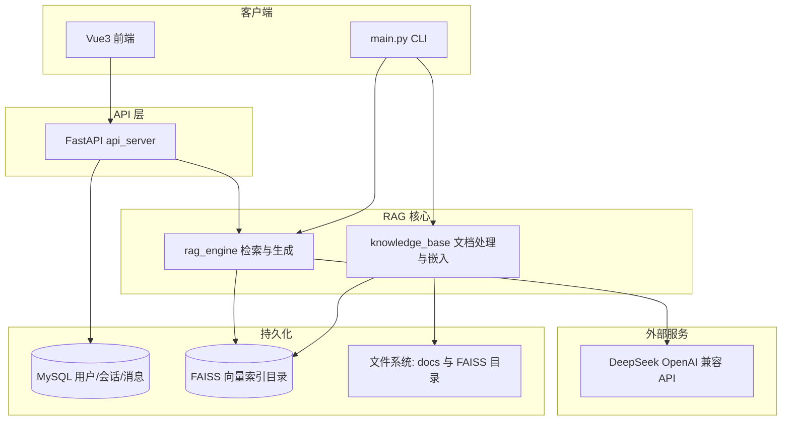
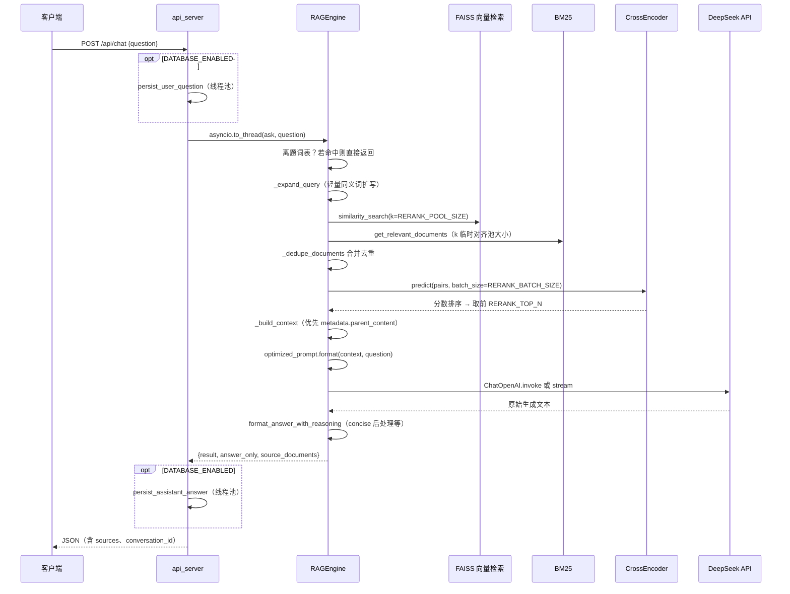
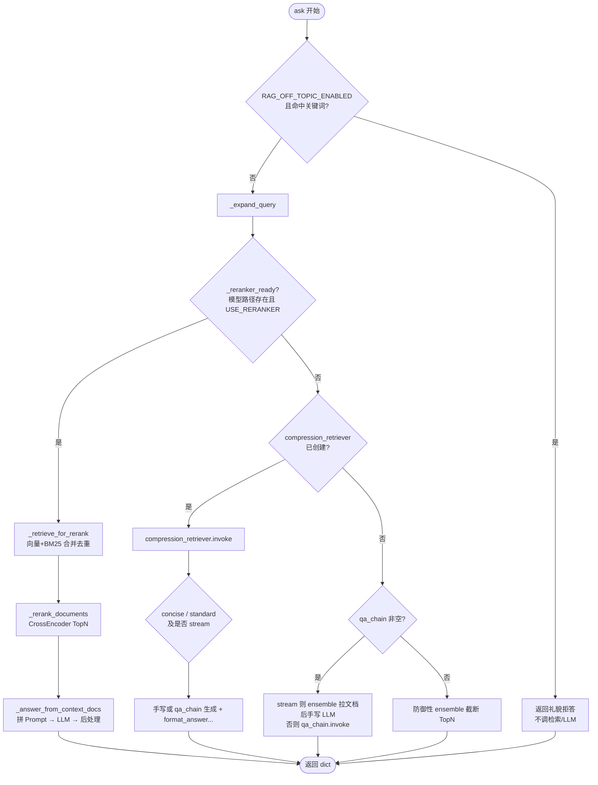

# HR RAG 系统 — 业务逻辑与架构说明

本文档梳理 `my_rag_system` 的**业务目标**、**模块边界**、**数据如何流动**、**存储分层**，以及**代码阅读顺序与核心分支逻辑**，便于维护、学习与二次开发。

---

下表按「先搞懂主干、再深入细节」排序；标 ★ 为建议精读。

| 优先级 | 文件 / 符号　　　　　　　　　　　　　　　　　　　　　　　　　　　　 | 学什么　　　　　　　　　　　　　　　　　　　　　　　　　　　　　　　　　　　　　　　　　　　　　　　|
| --------| ---------------------------------------------------------------------| -----------------------------------------------------------------------------------------------------|
| ★★★　　| `rag_engine.py` → `RAGEngine.ask`　　　　　　　　　　　　　　　　　 | 一次问答的**完整分支**：离题短路、重排链、压缩链、RetrievalQA、流式回调。　　　　　　　　　　　　　 |
| ★★★　　| `rag_engine.py` → `_build_context` / `format_answer_with_reasoning` | **父子块**如何进 Prompt；**推理+最终答案**如何拆分；**concise** 后处理如何约束忠实度。　　　　　　　|
| ★★　　 | `knowledge_base.py` → `KnowledgeBase.process_document`　　　　　　　| 文档如何切成**父块/子块**、谁写入 FAISS。　　　　　　　　　　　　　　　　　　　　　　　　　　　　　 |
| ★★　　 | `config.py`（前半）　　　　　　　　　　　　　　　　　　　　　　　　 | `.env` 如何映射到 `SEARCH_K`、`RERANK_*`、`RAG_LLM_MAX_TOKENS`、`RAG_LOW_LATENCY_MODE` 等。　　　　 |
| ★★　　 | `api_server.py` → `chat` / `_chat_stream_events`　　　　　　　　　　| FastAPI 为何用 **`asyncio.to_thread`** 调同步 `ask`；SSE 如何用**队列+工作线程**把 token 送回协程。 |
| ★　　　| `db/chat_store.py`、`db/auth.py`　　　　　　　　　　　　　　　　　　| 会话与消息的落库、`X-API-Key` 如何映射用户。　　　　　　　　　　　　　　　　　　　　　　　　　　　　|
| ★　　　| `ragas/*`　　　　　　　　　　　　　　　　　　　　　　　　　　　　　 | 评测如何复用同一套 `config` 与 `RAGEngine`。　　　　　　　　　　　　　　　　　　　　　　　　　　　　|

**推荐阅读顺序**：`main.py`（最短闭环）→ `api_server.py` 的 `_lifespan` + `chat` → `rag_engine.py` 的 `ask` → `knowledge_base.py` 的切块 → `config.py` 的 Prompt 与检索参数。

---

## 1. 项目定位

- **业务**：面向企业 HR 制度（或可替换 Prompt 的其他制度类）的**检索增强问答（RAG）**。
- **能力**：将 `docs/` 下制度文档（或种子文档）向量化写入 **FAISS** → 用户提问 → **混合检索**（向量 + BM25，可选 CrossEncoder 重排）→ **DeepSeek** 等大模型生成回答（含「推理 + 最终答案」结构化输出）。
- **形态**：
  - **CLI**：`main.py` 交互式问答。
  - **HTTP API**：`api_server.py`（FastAPI），供 **Vue 3 前端**或第三方调用。
  - **评测**：`ragas/` 下脚本与 RAGAS 指标（如 faithfulness、answer_relevancy）。

---

## 2. 总体架构（逻辑分层）



**要点**：

- **向量检索**始终在本地 **FAISS**（目录由 `FAISS_INDEX_PATH` 配置），**不写入 MySQL**。
- **MySQL**（可选）仅存 **用户、会话、问答消息** 等业务数据；未配置 `DATABASE_URL` 时 API 行为与旧版一致，不落库。
- **静态制度文档**默认在 `docs/`（`DOCS_DIR`）；索引输出在 `FAISS_INDEX_PATH`。

---

## 2.1 单次问答核心调用链（HTTP → RAG → LLM）

下面描述**生产环境最常见路径**：已配置 `USE_RERANKER=true`、CrossEncoder 加载成功、非流式 `POST /api/chat`。



**要点**：

- FastAPI 路由是 **async**，而 `RAGEngine.ask` 内部大量 **同步** 调用（LangChain、sentence-transformers、阻塞式 HTTP），故用 **`asyncio.to_thread`** 把整个 `ask` 丢进线程池，避免卡住事件循环。
- **流式**路径相同逻辑在 `ask(..., stream_callback=...)` 中；`api_server._chat_stream_events` 用**后台线程**跑 `ask`，通过 **`call_soon_threadsafe` + `asyncio.Queue`** 把 delta 交给主协程写 SSE。

---

## 2.2 `RAGEngine.ask` 分支决策树（逻辑总览）

实现位置：`rag_engine.py` 中 `ask` 方法。下列判断按代码顺序执行。



**设计意图简述**：

- **优先 CrossEncoder 路径**：若先走「上下文压缩检索」，会对每条候选再调 LLM 摘录，成本高且与精排目标重叠，故在 `USE_RERANKER=true` 时**不走**压缩器作为主路径。
- **`qa_chain`**：在未启用重排、且 CrossEncoder 未就绪时的兜底链式调用；**流式**时不能直接用 `RetrievalQA.invoke`（不暴露 token 流），故改为 **ensemble 取文档 + `_llm_generate(..., stream_callback)`**。

---

## 3. 核心模块职责

| 模块 | 文件 | 职责 |
|------|------|------|
| 配置 | `config.py` | 环境变量、路径解析（`DOCS_DIR`、`FAISS_INDEX_PATH`、种子文档、`DATABASE_URL`、API/CORS、检索与重排参数、Prompt 模板入口等）。 |
| 知识库 | `knowledge_base.py` | HuggingFace 嵌入；PDF/Word/TXT 加载与清洗；**父子切块**（父块约 1200 字、子块约 300 字，子块 metadata 带 `parent_content`）；`create_vector_store` / `load_vector_store`。 |
| 检索与生成 | `rag_engine.py` | 向量检索 + BM25 **Ensemble**；可选 **CrossEncoder** 重排；`RetrievalQA` 或手写 prompt + LLM；**concise** 后处理；**推理/最终答案**拆分字段 `answer_only`；支持 **流式** `stream_callback`。 |
| HTTP | `api_server.py` | 生命周期内：`init_database` → `KnowledgeBase` → 有磁盘 FAISS 则加载，否则用种子文档建库；问答、SSE 流式、会话列表与历史；健康检查含 DB ping。 |
| 数据库 | `db/` | SQLAlchemy 模型：`rag_users`、`rag_conversations`、`rag_messages`；鉴权 `X-API-Key`（可选）；聊天落库。 |
| 入口 | `main.py` | 无 FAISS 时按 `get_seed_document_path()` 建库；交互式流式问答。 |
| 评测 | `ragas/*` | 构造评测集、调用 `RAGEngine.ask`、RAGAS 打分；与主站配置共用 `config`。 |

---

## 4. 核心 RAG 机制详解

本节对应实现位置：`config.py`（Prompt / 环境变量）、`knowledge_base.py`（切块与嵌入）、`rag_engine.py`（检索、压缩、生成与后处理）、`db/*`（会话持久化）。

### 4.1 Prompt 注入防护（现状与边界）

**实现方式（软防护，非独立安全模块）**：

- **结构分隔**：`HR_PROMPT_TEMPLATE` 用明确标记划分 `【上下文】` 与 `【问题】`，降低用户把恶意指令伪装成「上下文」时的歧义（模型仍可能受强越狱话术影响）。
- **行为约束**：模板中的「铁律」要求最终答案仅基于所给上下文、无信息时固定回复「根据提供的文档，无法找到相关信息」，并禁止套话与答非所问。
- **生成参数**：`ChatOpenAI` 使用 **`temperature=0`**，减少随机发挥空间。
- **不含**：输入消毒（如拒绝含「忽略上文」的子串）、单独的小型分类器、或与用户输入物理隔离的管道。**生产环境**建议在网关或 WAF 层做限流、敏感词与异常模式检测。

### 4.2 长文本与上下文压缩

- **动机**：检索到的片段总长度可能超过模型有效注意力或引入噪声，影响忠实度与费用。
- **实现**：`RAGEngine` 初始化时，若 LangChain 提供 `LLMChainExtractor` 与 `ContextualCompressionRetriever`，则用**同一 DeepSeek 客户端**对 **Ensemble 检索结果**再做一轮「与问题相关的摘录」压缩（见 `rag_engine.py` 中 `compression_retriever`）。
- **与切块关系**：压缩作用于**已检索到的文档列表**，不改变 FAISS 中存储的 chunk；若压缩器导入失败则自动回退为原始 Ensemble 检索结果。

### 4.3 Chunk（切块）策略

- **位置**：`knowledge_base.py` → `KnowledgeBase.process_document`。
- **父子索引（Parent–Child）**：
  - **父块**：`RecursiveCharacterTextSplitter`，`chunk_size=1200`、`overlap=100`，分隔符优先段落与中文句读（`\n\n`、`。！？` 等），保证语义相对完整。
  - **子块**：`chunk_size=300`、`overlap=30`，更细粒度以便向量命中；每个子块 `metadata` 写入 `parent_id`、`parent_content`（及 `is_parent=False`）。
- **索引对象**：仅**子块**写入 FAISS；生成上下文时 `rag_engine._build_context` **优先用 `parent_content`** 拼进 Prompt，使模型看到更大范围原文，减轻「子块过碎导致断章取义」。
- **清洗**：加载后对 `page_content` 做换行归一、多余空白与零宽字符清理（`_clean_text` / `_clean_documents`）。

### 4.4 幻觉控制（忠实度与相关性）

**多层叠加，非单一开关**：

| 层级 | 机制 | 代码入口 |
|------|------|----------|
| 检索 | 向量 + BM25 混合；可选 CrossEncoder 重排；`RERANK_TOP_N` 限制进入上下文的条数 | `RAGEngine._retrieve_for_rerank`、`_rerank_documents` |
| Prompt | 要求先推理再「最终答案：」；铁律约束只答所问 | `config.HR_PROMPT_TEMPLATE` |
| 后处理（`RAG_PROMPT_STYLE=concise`） | 换行压平；多「；」分句且**字面不在检索拼接正文中则剔除**；多问号时裁掉多余分句；可选上下文扩窗（须提高与问题的字符重合才采纳） | `apply_concise_answer_postprocess` 及 `clip_*` / `expand_*` |
| 无答案话术 | 保留「根据提供的文档，无法找到相关信息」整句，避免后处理误伤 | `clip_concise_clauses_by_context` 等中的显式判断 |

说明：`config.py` 中的 `SIMILARITY_THRESHOLD` / `RELEVANCE_THRESHOLD` 为预留常量，**当前检索路径未读取**，向量阈值过滤以检索器 `k` 与重排为主。

### 4.5 记忆机制

- **持久化记忆（有）**：配置 `DATABASE_URL` 后，API 将用户消息与助手回复写入 MySQL（`rag_conversations` / `rag_messages`）；前端用 `conversation_id` 与 `GET .../messages` **恢复 UI 历史**。
- **模型上下文记忆（无）**：`RAGEngine.ask(question)` **每次仅将当前 `question` + 检索得到的 `context` 填入 Prompt**，**不把历史轮次拼进 LLM**。因此多轮场景下，模型**看不到**前几轮对话文本，除非后续在产品层实现「摘要或检索增强的记忆注入」。
- **前端本地**：`localStorage` 保存最近 `conversation_id` 用于刷新恢复，与后端会话一致。

---

## 5. 业务逻辑流程

### 5.1 服务启动时（API）

1. **MySQL**：若配置了 `DATABASE_URL`，执行 `create_all` 并确保默认用户 `DEFAULT_APP_USER`（可选绑定 `API_SERVICE_API_KEY` 的 SHA256）。
2. **嵌入模型**：`KnowledgeBase` 加载本地或 Hub 嵌入（受 `LOCAL_MODEL_PATH` / `EMBEDDING_MODEL_NAME` 等影响）。
3. **向量索引**（`_bootstrap_rag_core`）：若 `FAISS_INDEX_PATH` 目录已存在 → **加载已有索引**；否则 → 使用 **`get_seed_document_path()`** 的**种子文档**建库并写入该目录。
4. 构造 **`RAGEngine(vectorstore)`**（内部再建 BM25、Ensemble、可选压缩器、QA 链等）。

### 5.2 单次问答（非流式）

1. 若启用 DB：根据 **`X-API-Key`**（可选）解析 `user_id`；**写入用户消息**；无 `conversation_id` 则**新建会话**。
2. `RAGEngine.ask(question)`：查询扩展（可选）→ 检索 →（可选重排/压缩）→ LLM → concise 与推理拆分 → 返回 `result` / `answer_only` / `source_documents`。
3. 若启用 DB：**写入助手消息**（含简要 extra，如 source 数量）。

### 5.3 流式问答（SSE）

1. 同上先落库用户侧并确定 `conversation_id`，SSE 首包可下发 **`meta.conversation_id`**。
2. 后台线程执行 `ask(..., stream_callback)`，主协程通过队列转发 **`delta`**。
3. 结束后发 **`final`**（含后处理全文与 `conversation_id`），并在工作线程内**写入助手消息**。

### 5.4 CLI（main.py）

- 逻辑简化：无索引则种子文档建库；循环 **`ask` + 流式打印**；**不落 MySQL**（除非未来接同一套持久化层）。

---

## 6. 存储与数据分层

| 数据类型 | 存放位置 | 说明 |
|----------|----------|------|
| 向量与 docstore | `FAISS_INDEX_PATH` 目录 | LangChain FAISS `save_local`；检索唯一真源。 |
| 静态源文档 | `DOCS_DIR`（默认 `docs/`） | 种子文档、人工放置的制度文件。 |
| 用户 / 会话 / 消息 | MySQL 表 `rag_*` | 仅当 `DATABASE_URL` 配置时启用。 |
| 密钥与模型路径 | `.env`（勿提交仓库） | `DEEPSEEK_API_KEY`、`DATABASE_URL`、`API_SERVICE_API_KEY` 等。 |

---

## 7. 配置入口（`.env` + `config.py`）

- **路径类**：`DOCS_DIR`、`FAISS_INDEX_PATH`、`SEED_DOCUMENT_PATH` / `DEFAULT_SEED_DOCUMENT` 等。
- **模型与检索**：`EMBEDDING_*`、`SEARCH_K`、`RERANK_*`、`USE_RERANKER`、`RAG_PROMPT_STYLE` 等。
- **延迟相关（重点）**：`RAG_LOW_LATENCY_MODE`（一键收紧池大小、passage 长度、TopN、`max_tokens`）、`RAG_LLM_MAX_TOKENS`（主链路 LLM 输出上限）、`RERANK_BATCH_SIZE` / `RERANK_POOL_SIZE` / `RERANK_MAX_PASSAGE_CHARS`。
- **API**：`API_HOST`、`API_PORT`、`API_CORS_ORIGINS`。
- **生产持久化**：`DATABASE_URL`、`DEFAULT_APP_USER`、`API_SERVICE_API_KEY`、`API_REQUIRE_API_KEY`。
- **Prompt**：`RAG_SYSTEM_TYPE` 与 `get_current_prompt_template()`（当前 HR 模板在 `config.py`）。

`config.py` 文件内分区大致为：环境变量与线程安全默认值 → 嵌入与 DeepSeek → CrossEncoder 路径 → `_env_bool` / `_env_int` → 检索与重排数值 → 低开销模式与 `RAG_LLM_MAX_TOKENS` → Prompt 风格与离题短路 → RAGAS 相关工厂函数 → API/FAISS 路径等（以源码顺序为准）。

---

## 8. 前端（`frontend/`）

- **Vite + Vue 3**：对话 UI、流式解析 SSE、`conversation_id` 多轮回传、可选 **`VITE_API_KEY`** 请求头。
- 开发态通过 **Vite 代理** 将 `/api` 转到后端 `8000`。
- 「新对话」清空前端状态并重置 `conversation_id`。

---

## 9. 评测子系统（`ragas/`）

- 与主项目共用 **`config`** 与 **`RAGEngine`**（或独立建库脚本如 `rebuild_index.py`）。
- 使用 **`answer_only`** 等字段做 RAGAS，避免推理前缀干扰部分指标。
- 入口可为 `run_eval.py` → `ragas/quick_eval.py` 等（以仓库当前脚本为准）。
- **指标优化过程与调参说明**（faithfulness / answer_relevancy、中文 RAGAS、评测对齐方式）：见同目录 **`METRICS_OPTIMIZATION.md`**。

---

## 10. 扩展与生产建议（摘要）

- **向量库**：单机 FAISS 可继续用；多实例或运维要求高时可迁 **Milvus / Qdrant / pgvector**，需改写 `KnowledgeBase`/`RAGEngine` 的 vectorstore 实现。
- **鉴权**：当前为 **API Key + 默认用户**；可扩展为 JWT、多租户 `tenant_id` 挂在会话表上。
- **运维**：`GET /health` 关注 `ok` 与 `database`；备份 **MySQL + FAISS 目录 + `docs/`**；`.env` 与模型目录按 `.gitignore` 不提交。

---

## 11. 关键文件速查

```
config.py          # 全局配置与 Prompt
knowledge_base.py  # 嵌入、切块、FAISS 读写
rag_engine.py      # 检索链、LLM、后处理、流式
api_server.py      # REST + SSE
db/                # MySQL ORM、鉴权、聊天持久化
main.py            # CLI
frontend/          # Vue 3
ragas/             # 评测脚本与数据
docs/              # 制度源文档、ARCHITECTURE、METRICS_OPTIMIZATION（指标优化说明）
tests/concurrency/ # /api/chat 并发压测脚本（可选）
```

---

## 12. 源码中的注释约定（便于学习）

- **模块顶部的长文档字符串**：说明职责、数据流、与本文档章节对应关系。
- **`# ---------- 区块标题 ----------` 或 `# ========== ... ==========`**：在 `rag_engine.py`、`api_server.py`、`knowledge_base.py`、`db/chat_store.py`、`db/database.py` 等文件中划分逻辑块，方便跳转。
- **函数 docstring**：说明输入输出、调用时机、与评测（RAGAS）或前端字段的对应关系；核心类方法（如 `RAGEngine.ask`、`_answer_from_context_docs`）补充「在整条链路中的位置」。

修改业务逻辑时，建议同步更新相关 docstring 与本文档 **§2.1 / §2.2**。

---

*文档版本随代码迭代；若接口或表结构变更，请同步更新本节。*
